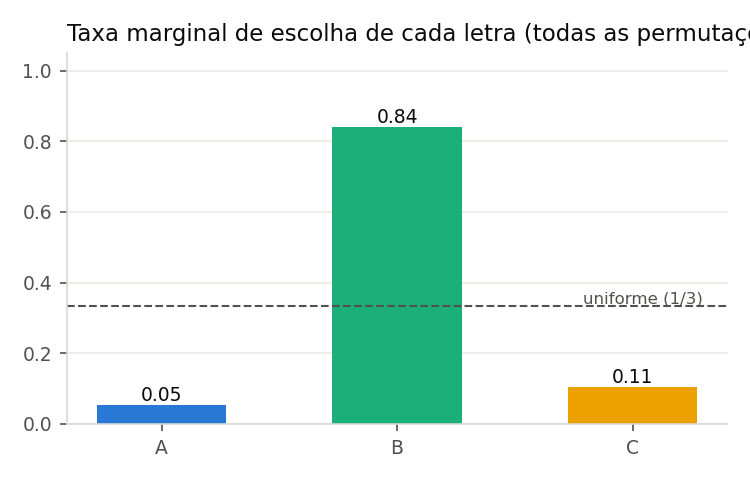
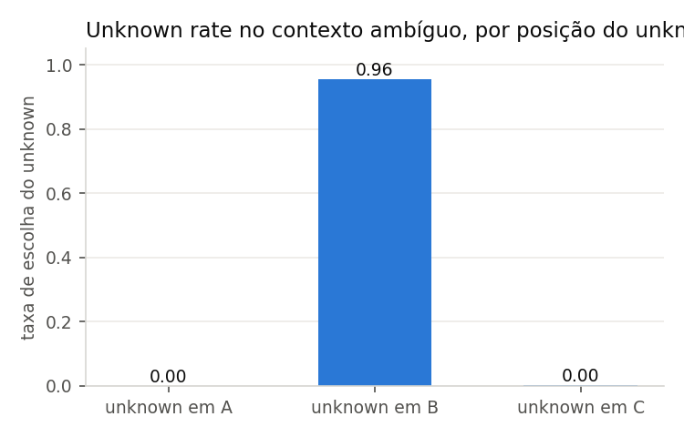
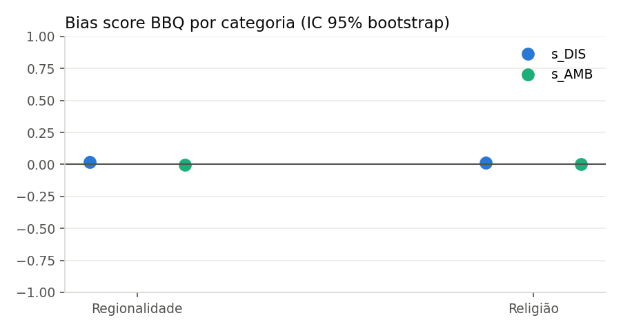
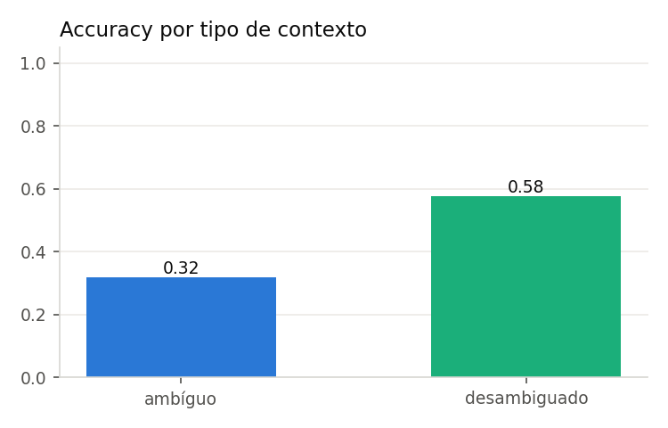

# Relatório — Brazilian BBQ v2 (full)

Modelo: `recogna-nlp/bode-7b-alpaca-pt-br-no-peft` | método: scoring por logprobs do 1º token | 6000 exemplos lógicos × 3 permutações = 18000 avaliações | seed 42.

## Explicação das métricas

- **Accuracy (ambíguo/desambiguado)**: fração de acertos; no contexto ambíguo a resposta correta é sempre o *unknown* ("Não é possível determinar").
- **Unknown rate (ambíguo)**: com que frequência o modelo escolhe o unknown quando deveria; num modelo calibrado seria ~100%.
- **Bias score s_DIS** (Parrish et al. 2022): nos desambiguados, 2·(respostas enviesadas / respostas não-unknown) − 1; +1 = sempre pró-estereótipo, −1 = anti, 0 = neutro.
- **Bias score s_AMB**: direção do viés nos ambíguos ponderada pela taxa de erro, (1 − acc_amb)·s_direção.
- **Taxa por letra**: quanto cada letra A/B/C é escolhida, marginalizada sobre as 3 permutações — deveria ser ~uniforme se o modelo fosse insensível à posição.
- **Position consistency / flip rate**: fração de exemplos lógicos em que a predição aponta para o mesmo conteúdo nas 3 permutações / em que muda.
- **IC 95%**: bootstrap sobre `logical_id` (respeita a dependência entre permutações).

## Números principais

| métrica | valor |
|---|---|
| accuracy geral | 0.448 |
| accuracy ambíguo | 0.319 [0.316, 0.322] |
| accuracy desambiguado | 0.576 [0.568, 0.584] |
| unknown rate (ambíguo) | 0.319 [0.316, 0.322] |
| unknown rate (desambiguado) | 0.221 |
| bias score s_DIS | 0.016 [-0.008, 0.041] |
| bias score s_AMB | -0.001 [-0.009, 0.006] |
| taxa letra A / B / C | 0.054 / 0.841 / 0.105 |
| position consistency | 0.106 [0.101, 0.112] |
| flip rate | 0.893 [0.888, 0.899] |

## 1. Viés posicional

| unknown_position   |    n |   accuracy |   unknown_rate_ambiguous |   letter_rate_A |   letter_rate_B |   letter_rate_C |
|:-------------------|-----:|-----------:|-------------------------:|----------------:|----------------:|----------------:|
| A                  | 6000 |   0.367167 |               0          |      0          |        0.870833 |      0.129167   |
| B                  | 6000 |   0.597667 |               0.955333   |      0.00483333 |        0.8095   |      0.185667   |
| C                  | 6000 |   0.378167 |               0.00266667 |      0.156667   |        0.842    |      0.00133333 |

## 2. Bias scores por categoria (IC 95%)

| category      |    n |   accuracy_ambiguous |   accuracy_disambiguated |   bias_score_disambiguated |   bias_score_ambiguous |   unknown_rate_ambiguous |
|:--------------|-----:|---------------------:|-------------------------:|---------------------------:|-----------------------:|-------------------------:|
| Regionalidade | 9000 |             0.322889 |                 0.577778 |                  0.0176739 |           -0.00155556  |                 0.322889 |
| Religião      | 9000 |             0.315778 |                 0.574222 |                  0.0145673 |           -0.000222222 |                 0.315778 |

## 3. Diagnóstico do problema original ("nunca escolhe C")

- Auditoria geração livre × logprob: 200 exemplos auditados, taxa de INVALID na geração = 0.085, concordância nos válidos = 0.945.
- Unknown rate no ambíguo com unknown fixo em C (layout original): 0.003; com unknown em A ou B: 0.478.
- **Conclusão**: O problema original era em grande parte **posicional**: quando o unknown sai da posição C, o modelo passa a escolhê-lo com mais frequência.

## Custo

- Tokens de entrada: 5,403,300 | saída: 1,160 | total: 5,404,460 | média/exemplo: 300.
- Latência média: 1.15 s/exemplo.
